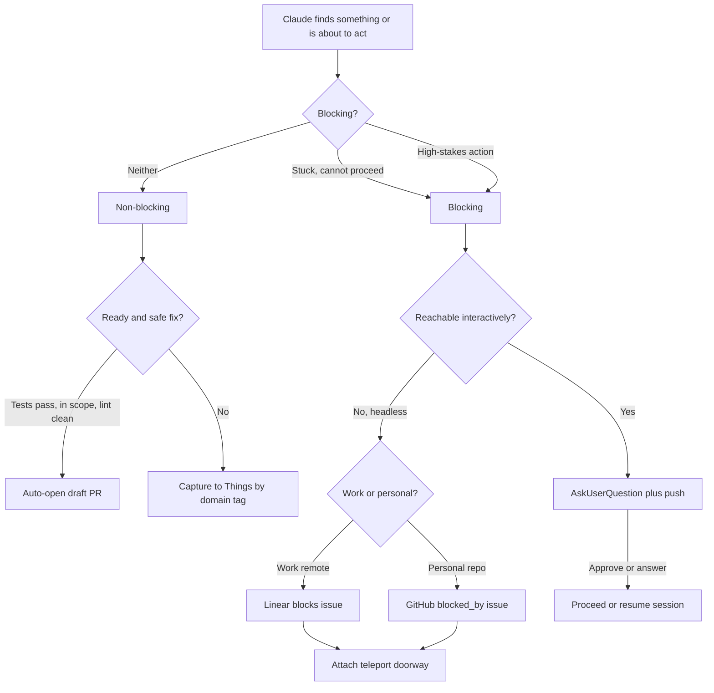

# Blocking and Non-Blocking Dispatch

## Problem

Claude works across many autonomous sessions and regularly finds things worth surfacing: a question it cannot resolve, a bug it could fix, an idea worth filing. Today everything funnels into one undifferentiated lane. Non-blocking surfacing goes to the Things inbox through `things:inbox`, and "blocking" exists only as a synchronous `AskUserQuestion` inside a live session.

Two capabilities are missing:

1. A distinction between **blocking** dispatch (Claude is parked and needs you before it can proceed, or it is about to take a high-stakes action) and **non-blocking** dispatch (an FYI you handle whenever).
2. An explicit choice of dispatch **form**. Dispatch does not always mean the task is done. Sometimes the right output is a captured todo, sometimes a filed issue, sometimes a ready-made pull request.

The goal is one model that lets Claude classify a finding, pick the form, and reach you through the right channel, while staying autonomous the rest of the time.

## Background

Two findings from the prior-art research shape the design.

#### The native task graph now models blocking

Claude Code's native task tools (v2.1.142+, Agent SDK 0.3.142+) added first-class dependencies: `TaskCreate` plus `TaskUpdate` with `addBlockedBy` and `addBlocks`. A blocking relationship is a real edge in the graph, not a flag. The graph is session-scoped (persisted under `~/.claude`), so it captures Claude's own reasoning about what blocks what, but it does not reach you or persist across systems on its own. This is the native dependency graph the design leans on.

#### Durable dependencies exist only in some trackers

Of the systems available here, the ability to express "this item blocks downstream work" as a durable, queryable edge differs sharply:

| System | Native blocking edge | Mechanism |
|--------|---------------------|-----------|
| Claude native tasks | Yes, but session-scoped | `TaskUpdate` `addBlockedBy` / `addBlocks` |
| GitHub Issues | Yes, durable (GA Aug 2025) | REST `dependencies/blocked_by`, GraphQL `addBlockedBy`, search `is:blocked` |
| Linear | Yes, durable | `issueRelationCreate` with `type: blocks` |
| Things 3 | No | Containment only (project, heading, checklist) |
| Apple Reminders | No | Subtask hierarchy only |

Things, the current default sink, cannot express a dependency at all. That constraint keeps Things as the FYI lane and pushes durable blocking work onto GitHub (personal) or Linear (work).

## Architecture

The native task graph is the spine. Dispatch reads a node from that graph and projects it outward, choosing a transport (how it reaches you) and a form (what artifact it becomes). The blocking nature is read from the graph or from the action at hand, rather than asserted.

Three concepts stay separate, following the cross-framework vocabulary:

#### Gate

A blocking dependency. The session cannot complete past this node until you respond. Two triggers: Claude is stuck, or Claude is about to take a high-stakes action. Transport: `AskUserQuestion` plus mobile push.

#### Notification

A one-way FYI. Claude proceeds or ends. Transport: a Things capture, or a draft PR for a ready fix.

#### Handoff

A transfer of context so you can resume where Claude stopped. Transport: the teleport doorway (`claude --teleport <session>`) already used by `agent-ideas`.

### Classification

A finding is blocking when either condition holds:

#### Stuck

Continuing the current work depends on your answer and Claude cannot reason its way through. Modeled as a real edge: the downstream resume task is `blockedBy` the finding.

#### High-stakes action

Claude is about to take an action whose blast radius warrants approval even when Claude could proceed. The gated set is deploys and releases, external sends (email, Slack, public posts), money and payment actions, and destructive deletion of cloud resources, infrastructure, or data (dropping a table or database, tearing down a resource). Force-push and history rewrite, and production database migrations, are gated by default. Git branch hygiene is explicitly not gated: deleting local or remote branches and cleaning up worktrees run without confirmation, since they are routine and recoverable, and GitHub auto-delete already handles merged remote branches.

Everything else is non-blocking.

### Form selection

Claude picks the form per finding, routing by confidence and blast radius.

#### Ready, safe fix

Auto-open a draft PR through `pull-request:create`, then drop a Things capture with the PR link so it joins your inbox triage. The draft state is the safety gate, the PR is a proposal in your review queue, not finished work. A draft opens only when all three hold: tests pass locally, edits stay within the task's files and scope, and lint and formatting are clean. Anything failing the bar becomes a captured suggestion instead.

#### Needs a decision, must persist

File a durable blocking issue. Work findings go to Linear, personal findings to GitHub, decided by the git remote (see routing below).

#### Pure FYI

Capture a todo through `things:inbox`, tagged by domain (see lanes below).

### Work versus personal routing

Read the git remote. Your day-job org or host routes durable blocks to Linear. Personal GitHub repos route to GitHub Issues. When the remote is ambiguous or absent, ask once and carry the answer.

### Where dispatches land

Two surfaces, each matching where you already look.

#### Personal

FYIs, personal-repo blocks, and Claude-opened PRs consolidate so the Things inbox and your GitHub notifications cover them.

#### Work

Work dispatches stay in Linear, where your day-job triage already lives. Dispatch does not duplicate them into Things.

### Non-blocking lanes

Reuse the lanes you already drain rather than inventing a triage workflow.

#### Config findings

Tag `claude-code` so `improve-claude-code` picks them up, unchanged.

#### General findings

Tag plain `Claude` for your normal inbox pass.

### Trigger scope

Reactive plus light proactive. Claude dispatches things it runs into while doing the task you gave it, and flags an obvious adjacent problem in a file it edited this session. It does not flag issues in files it only read, and it does not scan the repo for problems beyond the task.

### Diagram

### Data flow

1. Claude encounters a finding mid-session, or reaches a high-stakes action. It represents the finding as a node in the native task graph, and for a stuck case links the downstream resume task with `addBlockedBy`.
2. The router classifies. Stuck or high-stakes marks it blocking. Otherwise non-blocking.
3. **Non-blocking, ready fix.** When tests pass, the change stays in scope, and lint is clean, Claude auto-opens a draft PR and drops a Things capture with the PR link so it surfaces in your inbox triage.
4. **Non-blocking, FYI.** Otherwise Claude captures a todo through `things:inbox`, tagged by domain, carrying the `Session: <uuid>` marker for traceback.
5. **Blocking, reachable.** When a human can respond interactively (an interactive terminal, or a web or mobile remote-control session where push lands), Claude calls `AskUserQuestion`. A high-stakes gate shows the diff or command and offers approve, deny, or edit first. A denial halts the action and Claude asks what to do instead rather than guessing. A stuck case asks the decision question. Push is the attention signal. The response clears the block.
6. **Blocking, headless.** When no interactive channel exists, Claude does not call `AskUserQuestion` into the void. It files a durable blocking issue, Linear for work or GitHub for personal, with the dependency set so it is queryable (`is:blocked`), and attaches a teleport doorway so you can resume the exact session to respond.

### Design decisions

| Decision | Choice | Alternatives | Rationale | Notes |
|----------|--------|--------------|-----------|-------|
| Blocking model | Native task-graph edge (`addBlockedBy`) | A custom blocking tag on Things items | The edge encodes the semantics with no parallel state. Resolving the blocker makes the downstream task actionable. | Requires v2.1.142+. Flat `TodoWrite` fallback on older versions. |
| Router home | User-level skill under `user/skills` | `claude-code` plugin skill, standalone plugin | Orchestrates your personal Things, teleport, GitHub, and Linear, like `improve-claude-code`. Not meant to be shared. | Mirrors your existing meta-workflows. |
| Blocking triggers | Stuck plus high-stakes | Stuck only, or ask on any meaningful decision | Keeps interrupts rare and high-signal while gating costly actions. | Gated set below. |
| High-stakes set | Deploys and releases, external sends, money and payments, destructive cloud or data deletion, force-push, prod migrations | Gate git branch ops too | Gates costly or irreversible actions. | Git branch and worktree cleanup explicitly never gated, they must run uninterrupted. |
| Blocking transport | `AskUserQuestion` plus push | Two-way Channel, bare push | Your choice. No new infrastructure, push lands on web and mobile. | Unsafe in headless, Skill, and SDK contexts. Fallback below. |
| Headless fallback | Durable blocking issue plus teleport doorway | Stall on `AskUserQuestion` | `AskUserQuestion` returns empty answers with no TTY, so a headless gate would proceed on nothing. | `is:blocked` makes the queue queryable. |
| Gate interaction | Approve, deny, or edit first, with the diff or command shown | Open question, notify with cancel window | Fast to act on from your phone, and a person other than the actor decides. | A denial halts and asks what to do instead. Decision (stuck) cases ask an open question. |
| Form selection | Claude picks per finding | Always capture, capture-or-PR-only | Routes by confidence and blast radius. | Safe-PR bar below. |
| Safe-PR bar | Tests pass, in scope, lint clean | Add reversible or no-migration | A draft is reversible by closing, so the migration condition was redundant. | All three required to auto-open. |
| PR autonomy | Auto-open draft, notify | Whitelist only, always confirm | Maximizes autonomy, the draft state is the safety net. | Notify through a Things capture carrying the PR link. |
| Durable sink | Linear for work, GitHub for personal | Always one tracker | Matches where you already triage: Linear for the day job, GitHub for personal repos. | Inferred from the git remote, ask when unsure. |
| Attention surface | Things and GitHub for personal, Linear for work | Single Things pane, native per system | Each dispatch lands where you already look, no cross-posting. | Work items do not echo into Things. |
| Existing lanes | Generalize, reuse markers | Keep separate, fold later | Dispatch is the umbrella, `improve-claude-code` and `agent-ideas` keep draining config findings unchanged. | Reuses `Session` and fingerprint markers. |
| Trigger scope | Reactive plus light proactive, edited files only | Reactive only, read-or-edited files, proactive scanning | Catches obvious adjacent bugs without hunting or burning tokens. | Only files Claude edited this session, no repo scan. |

### Durability ladder

Choose the lowest rung that carries the finding.

#### Things

No dependency primitive. FYI leaves only.

#### Claude native task graph

Real dependencies, but ephemeral and session-scoped. Drives Claude's internal classification, not durable delivery.

#### GitHub or Linear

Durable, queryable dependencies with webhooks. The destination when a block must survive the session.

## Implementation

### Dispatch router

A user-level skill under `user/skills`, alongside `improve-claude-code` and `agent-ideas`. It owns no storage. It classifies a finding, applies the form heuristic, and calls existing skills as actuators. Keeping it a router avoids a parallel task store and reuses the markers and conventions already in place.

### Classification from the native graph

Gate the integration on Claude Code v2.1.142+. When present, Claude models a stuck finding by creating the finding task and linking the downstream resume task with `addBlockedBy`. The router treats any node with a dependent resume task as blocking, and adds the high-stakes action check on top. On older versions, fall back to a flat list and an explicit blocking marker.

### Form actuators

Reuse existing skills rather than reimplementing delivery.

#### Ready fix

`pull-request:create` opens the draft once the safe-PR bar passes. Follow the draft-as-proposal model.

#### Durable issue

For GitHub, create the issue through the `github` MCP server, then set the dependency through the REST `dependencies/blocked_by` endpoint or the GraphQL `addBlockedBy` mutation. For Linear, use `issueRelationCreate` with `type: blocks`.

#### FYI capture

`things:inbox` with the `Session: <uuid>` marker, tagged `claude-code` for config findings or plain `Claude` otherwise.

### Blocking gate transport

Call `AskUserQuestion` only when a human is reachable interactively. For a high-stakes gate, present the diff or command with approve, deny, and edit-first options. For a stuck decision, ask the question. Detect the headless case and divert to the durable issue plus teleport doorway, which protects against the documented empty-answer behavior of `AskUserQuestion` in headless, Skill, and SDK contexts (claude-code [#29547](https://github.com/anthropics/claude-code/issues/29547), [#29733](https://github.com/anthropics/claude-code/issues/29733)).

### Relationship to existing lanes

Dispatch generalizes the capture pattern that `improve-claude-code` and `agent-ideas` already use. It reuses their `Session: <uuid>` and fingerprint markers, so those workflows keep draining `claude-code`-tagged config findings without change. Dispatch adds the blocking and PR forms on top.

### Curation

Per the repository curation rule, define removal up front. This earns its cost if blocking dispatches get answered faster than the old single-lane captures, and if Claude-opened drafts land without rework. It is not earning its cost if blocking items pile up unanswered, or if the form heuristic routinely misroutes and you correct it. Both signals surface in the Things backlog and the PR review queue. Revisit after the first batch of real dispatches.

## Milestones

#### Form heuristic and FYI lane

Classify findings and route non-blocking ones. Safe fixes to draft PRs, everything else to `things:inbox` by domain tag. Delivers Claude picking the form with no new infrastructure.

#### Blocking gate

Add the blocking path through `AskUserQuestion` plus push, covering both the stuck decision and the high-stakes approve, deny, or edit gate, with the headless guard that diverts to the fallback.

#### Durable blocking

Project blocking findings that must survive as `blocked_by` issues, Linear for work and GitHub for personal, routed by remote. Attach teleport doorways.

#### Native graph as spine

Drive classification from the native task graph using `addBlockedBy` edges. Gate on version with a flat-list fallback.

## Open questions

1. **Work remote list.** The specific org or host that marks a remote as the day job, for the Linear routing. Supplied at build time.
2. **Reachability detection.** The concrete signal Claude uses to tell an interactive session (safe for `AskUserQuestion`) from a headless one (take the durable fallback).

## References

- [Building Effective AI Agents](https://www.anthropic.com/research/building-effective-agents), checkpoints and blockers
- [Claude Code task tracking](https://code.claude.com/docs/en/agent-sdk/todo-tracking), `TaskUpdate` `addBlockedBy` / `addBlocks`
- [GitHub issue dependencies](https://docs.github.com/en/rest/issues/issue-dependencies) and the [GA changelog](https://github.blog/changelog/2025-08-21-dependencies-on-issues/)
- [Linear issue relations](https://linear.app/docs/issue-relations)
- [GitHub Copilot coding agent](https://github.blog/news-insights/product-news/github-copilot-meet-the-new-coding-agent/), draft PR as dispatch object
- [HumanLayer](https://github.com/humanlayer/humanlayer), `require_approval` versus `human_as_tool`
- [evanisnor/dispatch](https://github.com/evanisnor/dispatch), blocking gates versus non-blocking escalations
- Existing skills: `things:inbox`, `improve-claude-code`, `agent-ideas` (teleport doorway), `pull-request:create`
