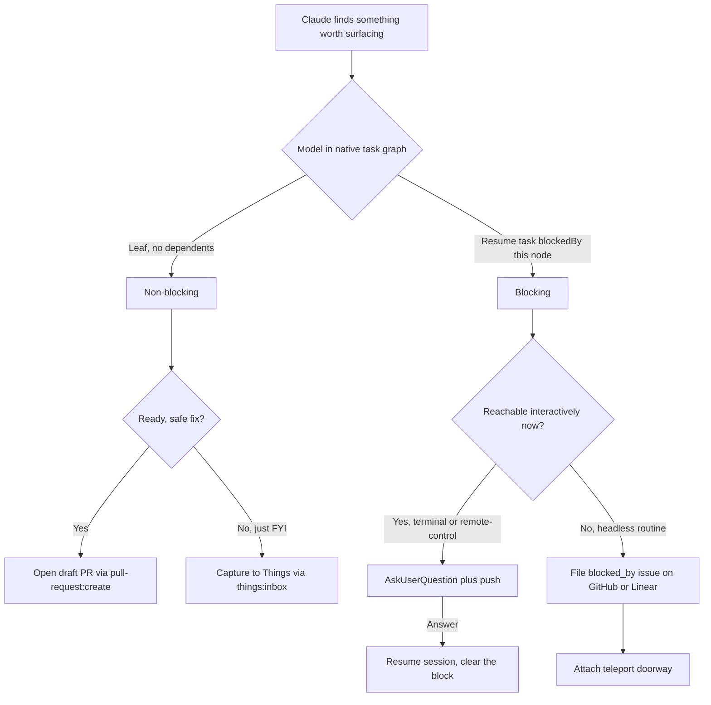

# Blocking and Non-Blocking Dispatch

## Problem

Claude works across many autonomous sessions and regularly finds things worth surfacing: a question it cannot resolve, a bug it could fix, an idea worth filing. Today everything funnels into one undifferentiated lane. Non-blocking surfacing goes to the Things inbox through `things:inbox`, and "blocking" exists only as a synchronous `AskUserQuestion` inside a live session.

Two capabilities are missing:

1. A distinction between **blocking** dispatch (Claude is parked and needs you before it can proceed) and **non-blocking** dispatch (an FYI you handle whenever).
2. An explicit choice of dispatch **form**. Dispatch does not always mean the task is done. Sometimes the right output is a captured todo, sometimes a filed issue, sometimes a ready-made pull request.

The goal is one model that lets Claude classify a finding, pick the form, and reach you through the right channel, while staying autonomous the rest of the time.

## Background

Two findings from the prior-art research shape the design.

#### The native task graph now models blocking

Claude Code's native task tools (v2.1.142+, Agent SDK 0.3.142+) added first-class dependencies: `TaskCreate` plus `TaskUpdate` with `addBlockedBy` and `addBlocks`. A blocking relationship is a real edge in the graph, not a flag. The graph is session-scoped (persisted under `~/.claude`), so it captures Claude's own reasoning about what blocks what, but it does not reach you or persist across systems on its own. This is the "native dependency graph" worth leaning on.

#### Durable dependencies exist only in some trackers

Of the systems available here, the ability to express "this item blocks downstream work" as a durable, queryable edge differs sharply:

| System | Native blocking edge | Mechanism |
|--------|---------------------|-----------|
| Claude native tasks | Yes, but session-scoped | `TaskUpdate` `addBlockedBy` / `addBlocks` |
| GitHub Issues | Yes, durable (GA Aug 2025) | REST `dependencies/blocked_by`, GraphQL `addBlockedBy`, search `is:blocked` |
| Linear | Yes, durable | `issueRelationCreate` with `type: blocks` |
| Things 3 | No | Containment only (project, heading, checklist) |
| Apple Reminders | No | Subtask hierarchy only |

Things, the current default sink, cannot express a dependency at all. That constraint pushes durable blocking work onto GitHub or Linear, and keeps Things as the FYI lane.

## Architecture

The native task graph is the spine. Dispatch reads a node from that graph and projects it outward, choosing a transport (how it reaches you) and a form (what artifact it becomes). Blocking versus non-blocking is read from the graph rather than asserted: a node with a dependent "resume" task that the session cannot complete without is blocking, a leaf node with no dependents is non-blocking.

Three concepts stay separate, following the cross-framework vocabulary:

#### Gate

A blocking dependency. The session cannot complete past this node until you answer. Transport: `AskUserQuestion` plus mobile push.

#### Notification

A one-way FYI. Claude proceeds or ends. Transport: a Things capture, or a PR for a ready fix.

#### Handoff

A transfer of context so you can resume where Claude stopped. Transport: the teleport doorway (`claude --teleport <session>`) already used by `agent-ideas`.

### Diagram

### Data flow

1. Claude encounters a finding mid-session and represents it as a node in the native task graph. If continuing the current work depends on it, Claude links the downstream "resume" task with `addBlockedBy`.
2. The dispatch router reads the node. A dependent resume task marks it blocking. A leaf marks it non-blocking.
3. **Non-blocking, ready fix.** When the fix is safe and confidence is high, Claude opens a draft PR through `pull-request:create`. The PR is the dispatch object, a proposal parked in your review queue, not finished work.
4. **Non-blocking, FYI.** Otherwise Claude captures a todo through `things:inbox`, carrying the `Session: <uuid>` marker for traceback.
5. **Blocking, reachable.** When a human can answer interactively (an interactive terminal, or a web or mobile remote-control session where push lands), Claude calls `AskUserQuestion`. The push notification is the attention signal. The answer clears the block and the session resumes.
6. **Blocking, headless.** When no interactive channel exists, Claude does not call `AskUserQuestion` into the void. It files a `blocked_by` issue on GitHub or Linear so the dependency persists and is queryable (`is:blocked`), and attaches a teleport doorway so you can resume the exact session to answer.

### Design decisions

| Decision | Choice | Alternatives | Rationale | Notes |
|----------|--------|--------------|-----------|-------|
| Blocking model | Native task-graph edge (`addBlockedBy`) | A custom blocking tag or flag on Things items | The edge encodes the semantics with no parallel state. Resolving the blocker makes the downstream task actionable. | Requires Claude Code v2.1.142+. Falls back to flat `TodoWrite` on older versions. |
| Blocking transport | `AskUserQuestion` plus push | Two-way Channel (Telegram, iMessage), bare mobile push | Your choice. No new infrastructure, push already lands on web and mobile. | Constraint below: unsafe in headless, Skill, and SDK contexts. |
| Headless blocking fallback | Durable `blocked_by` issue plus teleport doorway | Stall on `AskUserQuestion` | `AskUserQuestion` returns empty answers with no TTY, so a headless gate would silently proceed on nothing. A durable issue survives and the doorway resumes the session. | GitHub `is:blocked` makes the queue queryable. |
| Form selection | Claude picks per finding | Always capture, you escalate. Capture or PR only. | Your choice. Routes by confidence and blast radius: safe fix to PR, decision to issue, FYI to capture. | PR auto-open guardrail is an open question below. |
| FYI sink | Things via `things:inbox` | GitHub issue for everything | Things has no dependency primitive, which is fine for leaves. Reuses session attribution and the clickable URL. | Durable or blocking work climbs to GitHub or Linear. |
| Durable blocking sink | GitHub Issues (`blocked_by`), Linear (`blocks`) | Things, Claude native graph | Only these two persist a queryable dependency outside the session and emit webhooks. | GitHub `gh` CLI lacks native flags, so script the REST or GraphQL API. |

### Durability ladder

Choose the lowest rung that carries the finding.

#### Things

No dependency primitive. FYI leaves only.

#### Claude native task graph

Real dependencies, but ephemeral and session-scoped. Drives Claude's internal classification, not durable delivery.

#### GitHub or Linear

Durable, queryable dependencies with webhooks. The destination when a block must survive the session or coordinate work across systems.

Blocking work that must survive climbs to GitHub or Linear. Blocking work answerable now stays in-session on `AskUserQuestion` plus push. FYI stays in Things.

## Implementation

### Dispatch router

A thin `dispatch` skill that classifies a finding and routes it. It owns no storage. It reads the native task graph to decide blocking versus non-blocking, applies the form heuristic, and calls existing skills as actuators. Keeping it a router avoids a parallel task store and reuses the markers and conventions already in place.

Candidate home: a skill inside the `claude-code` plugin, or a small standalone `dispatch` plugin if it grows actuator-specific code. Resolve during the planning interview (see open questions).

### Classification from the native graph

Gate the integration on Claude Code v2.1.142+. When present, Claude models a blocking finding by creating the finding task and linking the downstream resume task with `addBlockedBy`. The router treats any node with a dependent resume task as blocking. On older versions, fall back to a flat list and an explicit blocking marker, with reduced fidelity.

### Form actuators

Reuse existing skills rather than reimplementing delivery.

#### Ready fix

`pull-request:create` opens the PR. Follow the Copilot model: a draft PR is a reviewable proposal, not merged work.

#### Durable issue

For GitHub, create the issue through the `github` MCP server, then set the dependency through the REST `dependencies/blocked_by` endpoint or the GraphQL `addBlockedBy` mutation. For Linear, use `issueRelationCreate` with `type: blocks`.

#### FYI capture

`things:inbox` with the `Session: <uuid>` marker, consistent with `improve-claude-code` and `agent-ideas`.

### Blocking gate transport

Call `AskUserQuestion` only when a human is reachable interactively. Detect the headless case and take the fallback path: a durable `blocked_by` issue plus a teleport doorway in the issue body. This protects against the documented empty-answer behavior of `AskUserQuestion` in headless, Skill, and SDK contexts (claude-code [#29547](https://github.com/anthropics/claude-code/issues/29547), [#29733](https://github.com/anthropics/claude-code/issues/29733)).

### Traceback and dedup

Carry the existing markers so dispatched items trace back and deduplicate the same way the current backlog does. `Session: <uuid>` links to the originating session for `claude-code:session` reconstruction. A fingerprint marker, as in `improve-claude-code`, suppresses re-filing the same finding.

### Curation

Per the repository curation rule, define removal up front. This feature earns its cost if dispatched blocking items get answered faster than the old single-lane captures, and if Claude-opened PRs land without rework. It is not earning its cost if blocking dispatches pile up unanswered, or if the form heuristic routinely picks the wrong artifact and you correct it. Both signals surface in the Things backlog and the PR review queue. Revisit after the first batch of real dispatches.

## Milestones

#### Form heuristic and FYI lane

Classify findings and route non-blocking ones. Safe fixes to draft PRs through `pull-request:create`, everything else to `things:inbox`. Delivers "Claude picks the form" with no new infrastructure.

#### Blocking gate

Add the blocking path through `AskUserQuestion` plus push, with the headless guard that diverts to the fallback rather than stalling.

#### Durable blocking

Project blocking findings that must survive as `blocked_by` issues on GitHub, then Linear. Attach teleport doorways. Makes the blocking queue queryable through `is:blocked`.

#### Native graph as spine

Drive classification from the native task graph rather than heuristics, using `addBlockedBy` edges. Gate on version with a flat-list fallback.

## Open questions

1. **Router home.** A skill in the `claude-code` plugin, or a standalone `dispatch` plugin?
2. **PR auto-open.** Should the form heuristic ever open a PR without asking, given the preference for autonomy, or always confirm before the PR form?
3. **GitHub versus Linear default** for durable blocking when both are viable for a finding.
4. **Marker reuse.** Adopt the `improve-claude-code` fingerprint scheme directly, or define a dispatch-specific marker?

## References

- [Building Effective AI Agents](https://www.anthropic.com/research/building-effective-agents), checkpoints and blockers
- [Claude Code task tracking](https://code.claude.com/docs/en/agent-sdk/todo-tracking), `TaskUpdate` `addBlockedBy` / `addBlocks`
- [GitHub issue dependencies](https://docs.github.com/en/rest/issues/issue-dependencies) and the [GA changelog](https://github.blog/changelog/2025-08-21-dependencies-on-issues/)
- [Linear issue relations](https://linear.app/docs/issue-relations)
- [GitHub Copilot coding agent](https://github.blog/news-insights/product-news/github-copilot-meet-the-new-coding-agent/), draft PR as dispatch object
- [HumanLayer](https://github.com/humanlayer/humanlayer), `require_approval` versus `human_as_tool`
- [evanisnor/dispatch](https://github.com/evanisnor/dispatch), blocking gates versus non-blocking escalations
- Existing skills: `things:inbox`, `improve-claude-code`, `agent-ideas` (teleport doorway), `pull-request:create`
