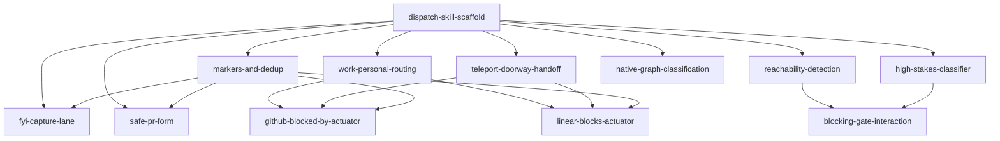

# Dispatch Implementation Tasks

Task breakdown for the [blocking and non-blocking dispatch spec](../blocking-dispatch.md). Each file is a self-contained unit a single focused session can implement end to end. Filenames are descriptive and order is expressed through the `Depends on` field, not numbering.

## Dependency graph

## Milestones

#### Form heuristic and FYI lane

`dispatch-skill-scaffold`, `markers-and-dedup`, `fyi-capture-lane`, `safe-pr-form`. The smallest shippable slice: Claude classifies a finding and routes non-blocking ones to a capture or a draft PR.

#### Blocking gate

`reachability-detection`, `high-stakes-classifier`, `blocking-gate-interaction`. Adds the blocking path through `AskUserQuestion` plus push, with the headless guard.

#### Durable blocking

`work-personal-routing`, `teleport-doorway-handoff`, `github-blocked-by-actuator`, `linear-blocks-actuator`. Persists blocks that must survive the session, routed to GitHub or Linear.

#### Native graph as spine

`native-graph-classification`. Drives classification from the native task dependency graph.

## Task index

- `dispatch-skill-scaffold.md`
- `markers-and-dedup.md`
- `fyi-capture-lane.md`
- `safe-pr-form.md`
- `reachability-detection.md`
- `high-stakes-classifier.md`
- `blocking-gate-interaction.md`
- `work-personal-routing.md`
- `teleport-doorway-handoff.md`
- `github-blocked-by-actuator.md`
- `linear-blocks-actuator.md`
- `native-graph-classification.md`
