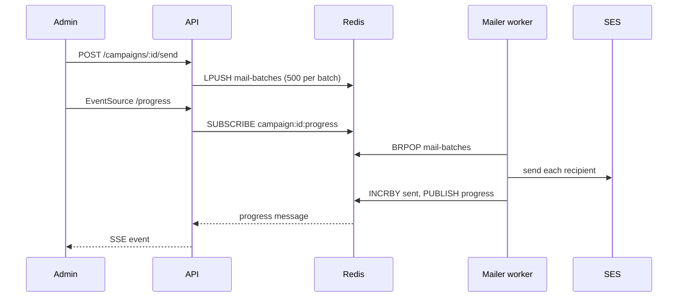

The API fans recipients into Redis batches, and the worker reports progress back over pub/sub.

```mermaid
sequenceDiagram
    participant Admin
    participant API
    participant Redis
    participant Worker as Mailer worker
    participant SES
    Admin->>API: POST /campaigns/:id/send
    API->>Redis: LPUSH mail-batches (500 per batch)
    Admin->>API: EventSource /progress
    API->>Redis: SUBSCRIBE campaign:id:progress
    Worker->>Redis: BRPOP mail-batches
    Worker->>SES: send each recipient
    Worker->>Redis: INCRBY sent, PUBLISH progress
    Redis-->>API: progress message
    API-->>Admin: SSE event
```
