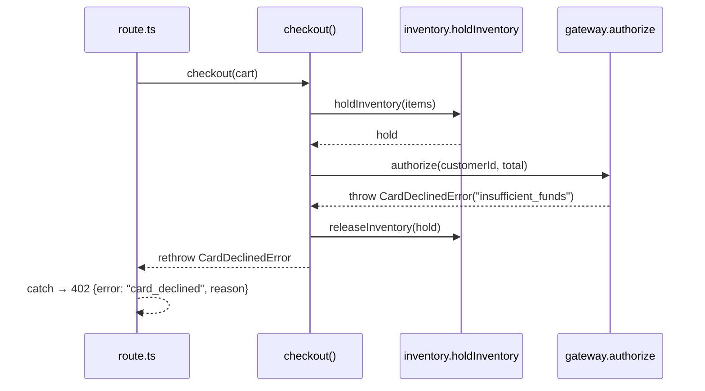

```mermaid
sequenceDiagram
    participant Route as route.ts
    participant Checkout as checkout()
    participant Inv as inventory.holdInventory
    participant Gateway as gateway.authorize

    Route->>Checkout: checkout(cart)
    Checkout->>Inv: holdInventory(items)
    Inv-->>Checkout: hold
    Checkout->>Gateway: authorize(customerId, total)
    Gateway-->>Checkout: throw CardDeclinedError("insufficient_funds")
    Checkout->>Inv: releaseInventory(hold)
    Checkout-->>Route: rethrow CardDeclinedError
    Route-->>Route: catch → 402 {error: "card_declined", reason}
```

Note `capture`/`voidAuthorization`, `awardPoints`, `scheduleShipment`, and `sendReceipt` never run — the throw happens at `authorize`, before any of them (checkout.ts:11).
