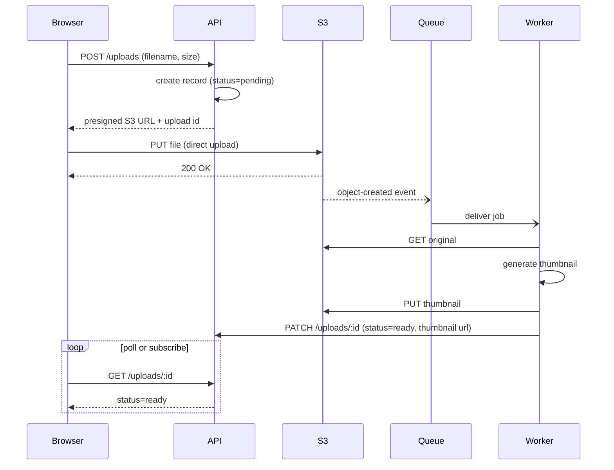

Two decoupled hops matter here: the browser talks to S3 directly for the raw bytes (API never proxies the file), and the worker learns about new files via the S3 event → queue, not by the API calling it directly. The browser only finds out about completion by asking the API again — either polling `GET /uploads/:id` or, if the API supports it, over a WebSocket/SSE push instead of the loop shown.
