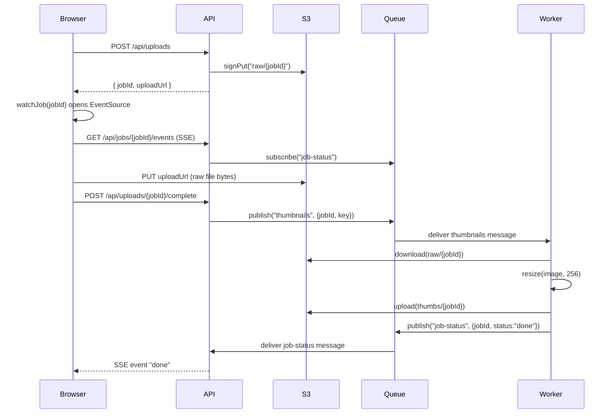

This is a presigned-upload pattern with a queue decoupling the API from the worker, and SSE decoupling job completion from the request/response cycle. Here's the full path:

**Step by step, with the code:**

1. **Browser kicks off the upload** — `uploadPhoto` (`web/upload.ts:2-6`) calls `POST /api/uploads` first, before touching S3.
2. **API mints a job and a presigned URL** — `startUpload` (`api/uploads.ts:5-8`) generates `jobId` and calls `signPut` (`api/storage.ts:2-4`), returning `{ jobId, uploadUrl }`. The API never sees the photo bytes.
3. **Browser uploads straight to S3** — `PUT uploadUrl` (`web/upload.ts:4`) sends the file directly to S3, bypassing the API entirely.
4. **Browser tells the API the upload finished** — `POST /api/uploads/{jobId}/complete` → `completeUpload` (`api/uploads.ts:10-12`) publishes `{jobId, key}` onto the `"thumbnails"` topic via the shared Redis queue (`api/queue.ts`).
5. **Browser starts listening before or around this time** — `watchJob` (`web/upload.ts:9-11`) opens an `EventSource` to `/api/jobs/{jobId}/events`. On the server, `streamJob` (`api/events.ts:4-8`) subscribes to the `"job-status"` topic and filters by `jobId`.
6. **Worker picks up the job** — a separate process, `worker/thumbnails.ts:4-8`, subscribed to `"thumbnails"`, downloads the raw object from S3, resizes it to 256px, and uploads the thumbnail back to S3 under `thumbs/{jobId}`.
7. **Worker announces completion** — publishes `{jobId, status: "done"}` on `"job-status"` (`worker/thumbnails.ts:7`).
8. **API relays it over SSE** — the `streamJob` subscription (`api/events.ts:5-7`) matches the `jobId` and calls `send("done")`, which flows down the open `EventSource` to the browser.

One gap worth flagging: `api/events.ts` exports `streamJob` but there's no visible route handler wiring it to `GET /api/jobs/:jobId/events`, and `api/queue.ts` is a stub with empty `publish`/`subscribe` bodies — so this trace shows the intended wiring, not something you could run as-is.
