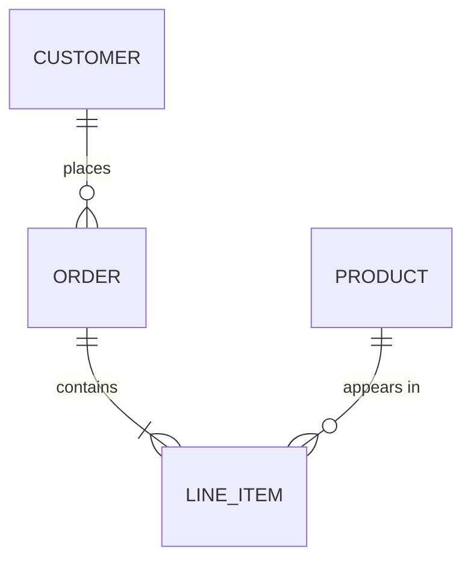
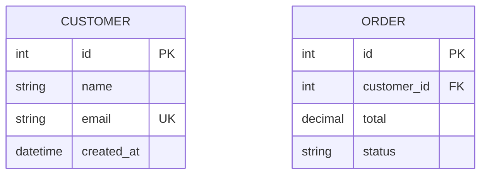
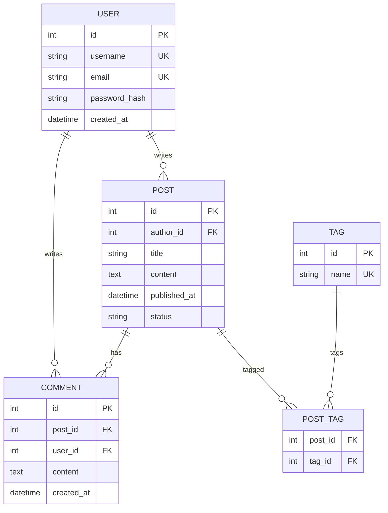

# Entity-Relationship Diagram Reference

## Basic Syntax



## Entities

Define entities with attributes:



Attribute markers:
- `PK` — Primary key
- `FK` — Foreign key
- `UK` — Unique key

## Relationship Cardinality

Left side | Right side | Meaning
----------|------------|--------
`\|o` | `o\|` | Zero or one
`\|\|` | `\|\|` | Exactly one
`}o` | `o{` | Zero or more
`}\|` | `\|{` | One or more

## Relationship Syntax

```
ENTITY1 <left-cardinality>--<right-cardinality> ENTITY2 : "label"
```

Examples:

| Syntax | Meaning |
|--------|---------|
| `\|\|--\|\|` | One to one |
| `\|\|--o{` | One to zero or more |
| `\|\|--\|{` | One to one or more |
| `o\|--o{` | Zero or one to zero or more |

## Example: Blog Schema



## Best Practices

- Use uppercase for entity names (convention)
- Include key markers (PK, FK, UK) for clarity
- Use quoted labels when relationship names have spaces
- Group related entities visually
- Show only essential attributes—full schemas belong in docs
