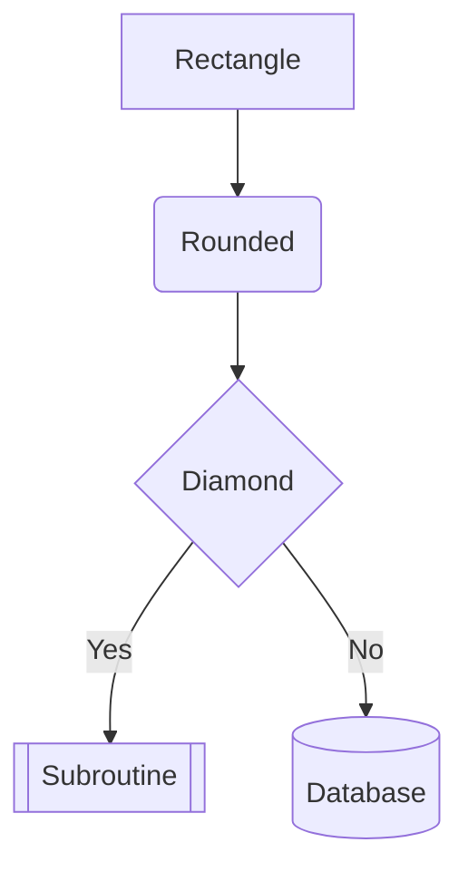
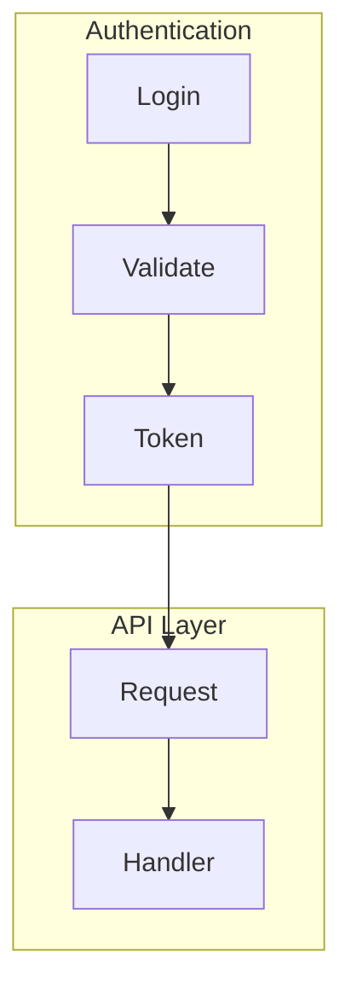
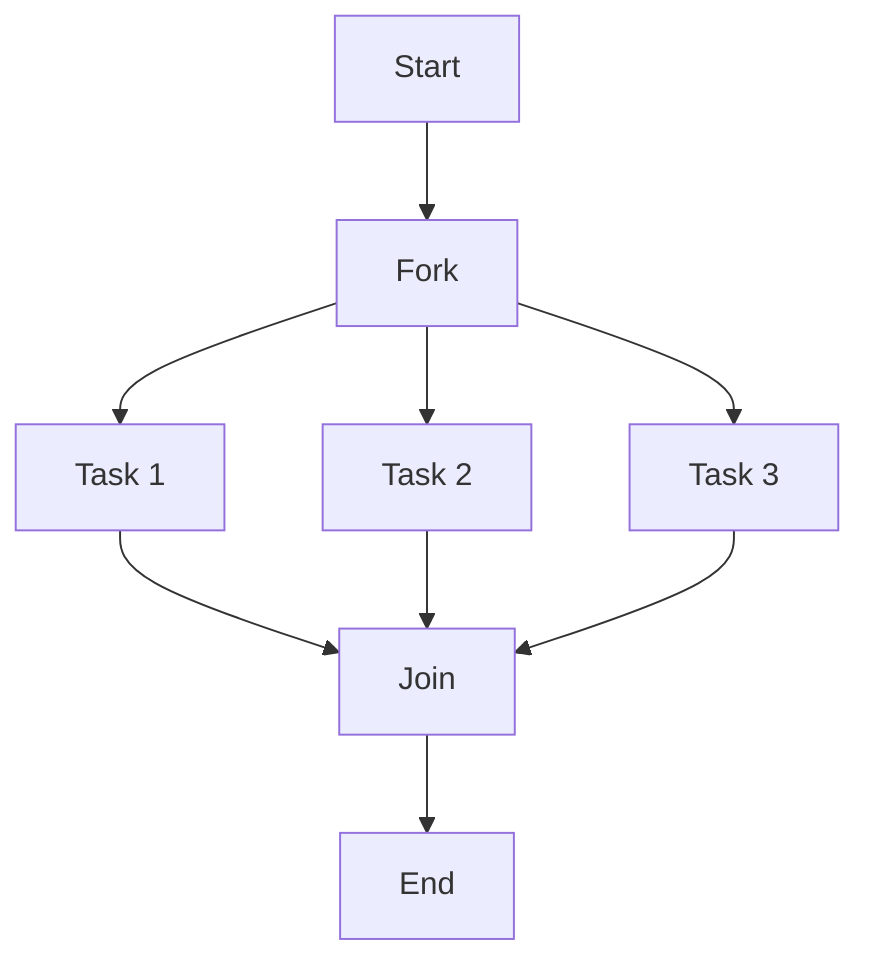
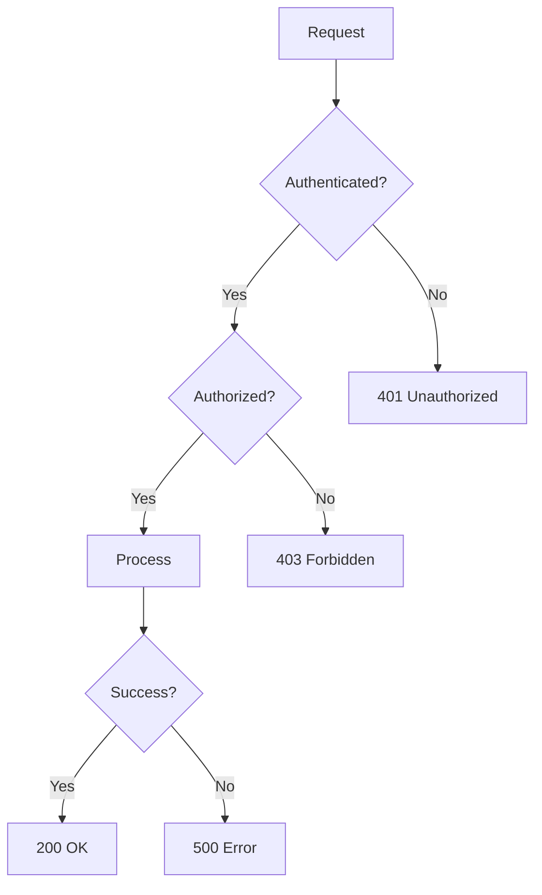
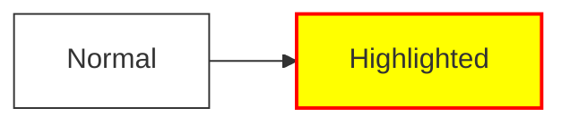

# Flowchart Reference

## Basic Syntax

## Direction

| Directive | Direction |
|-----------|-----------|
| `TB` / `TD` | Top to bottom |
| `BT` | Bottom to top |
| `LR` | Left to right |
| `RL` | Right to left |

Use `LR` for timelines and processes. Use `TB` for hierarchies and org charts.

## Node Shapes

| Syntax | Shape | Use For |
|--------|-------|---------|
| `[text]` | Rectangle | Actions, processes |
| `(text)` | Rounded | Start/end points |
| `{text}` | Diamond | Decisions |
| `[[text]]` | Subroutine | Function calls |
| `[(text)]` | Cylinder | Databases |
| `((text))` | Circle | Events, triggers |
| `>text]` | Flag | Async signals |
| `{{text}}` | Hexagon | Preparation steps |

## Edge Types

| Syntax | Style |
|--------|-------|
| `-->` | Arrow |
| `---` | Line (no arrow) |
| `-.->`| Dotted arrow |
| `==>` | Thick arrow |
| `--text-->` | Arrow with label |
| `-->|text|` | Arrow with label (alt) |

## Subgraphs

Group related nodes:

Subgraphs inherit parent direction. Use them for:
- Logical grouping (auth, database, external services)
- Swimlanes (by team or system)
- Phases (input, processing, output)

## Parallel Paths

Show concurrent operations:

## Decision Trees

## Styling

Define classes and apply them:

## Layout Tips

- Minimize edge crossings by ordering nodes logically
- Use subgraphs to reduce visual complexity
- Keep labels short—expand in surrounding text
- For wide diagrams, consider `TB` instead of `LR`
