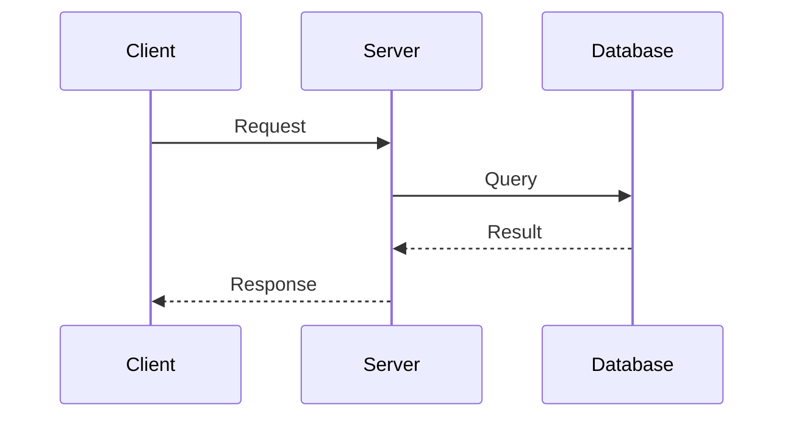
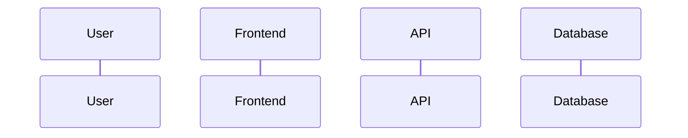
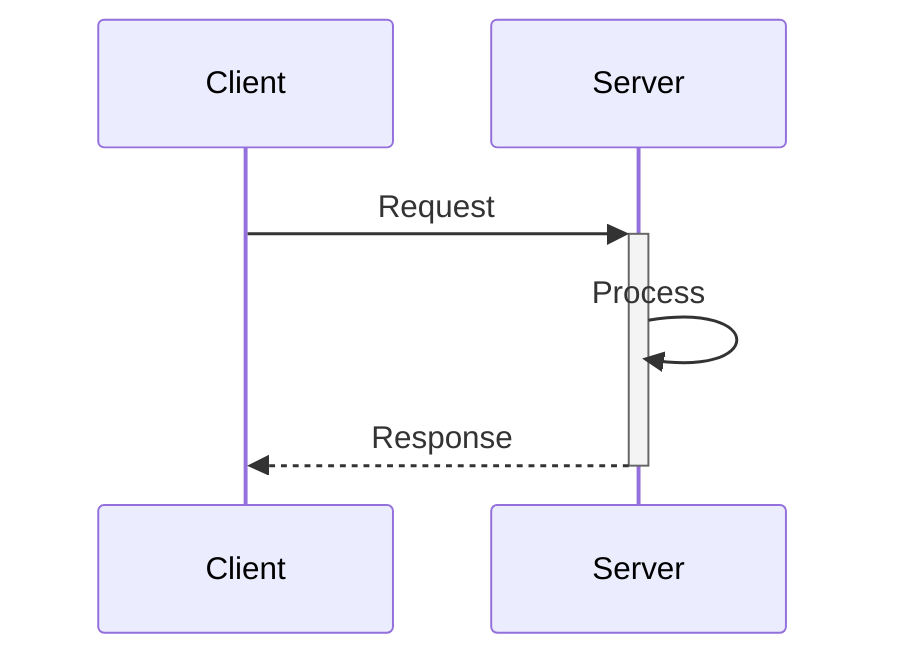
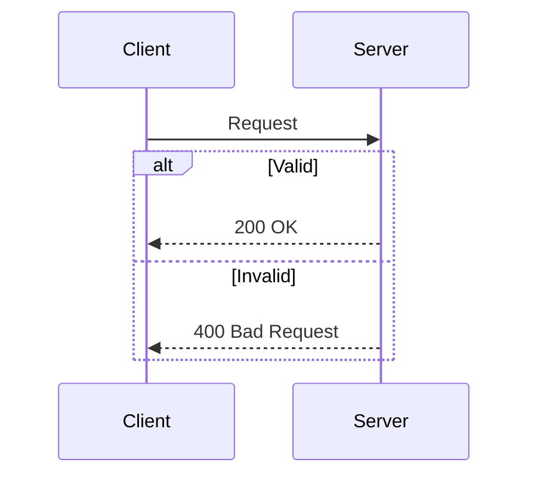
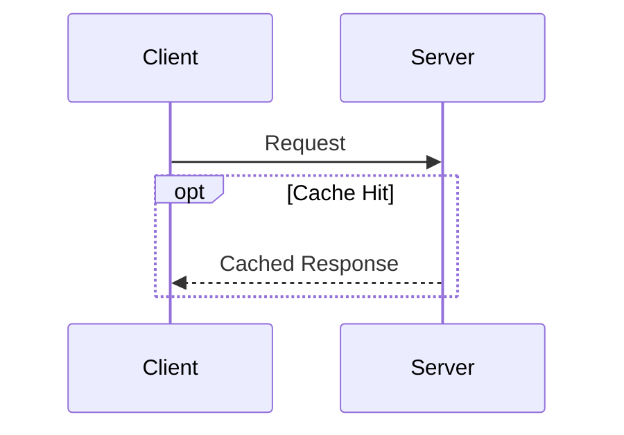
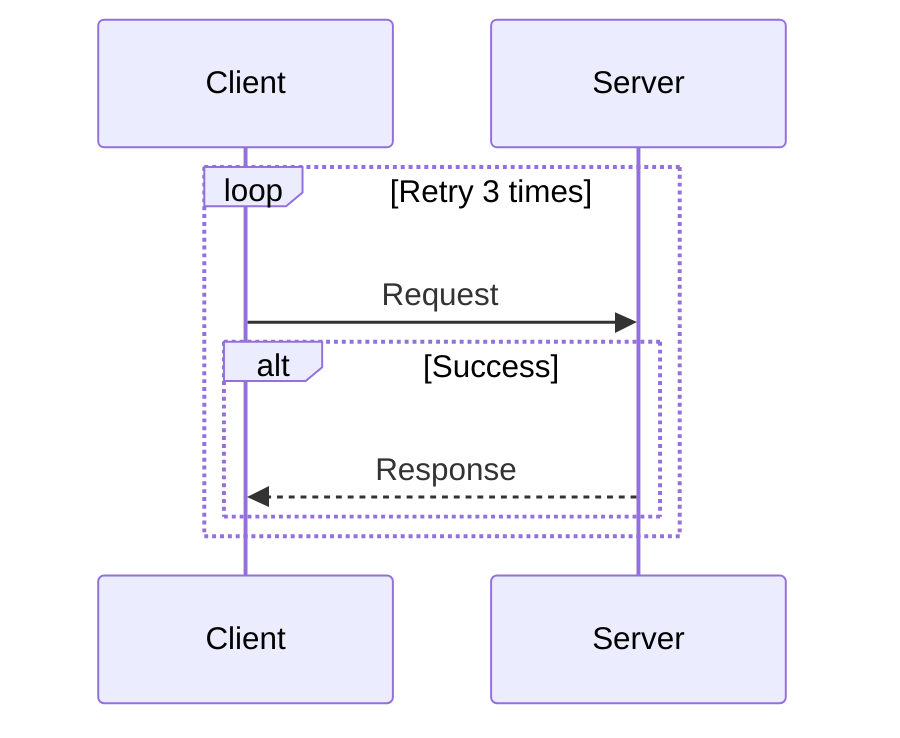
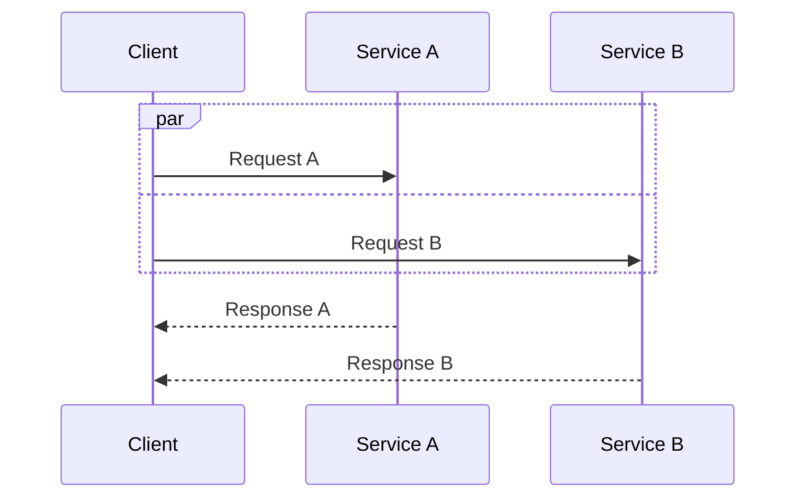
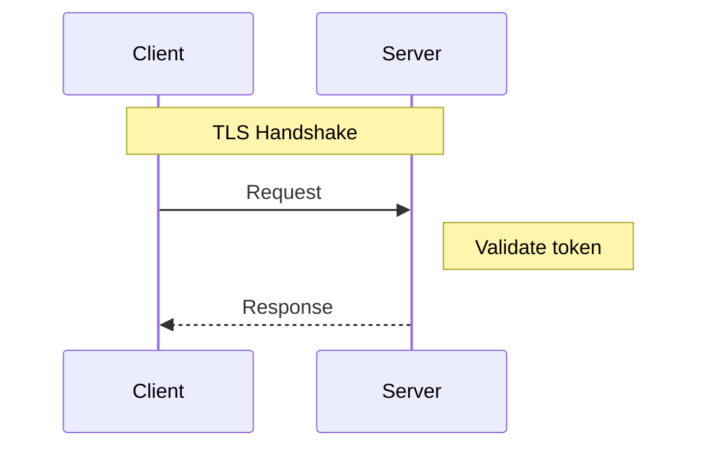
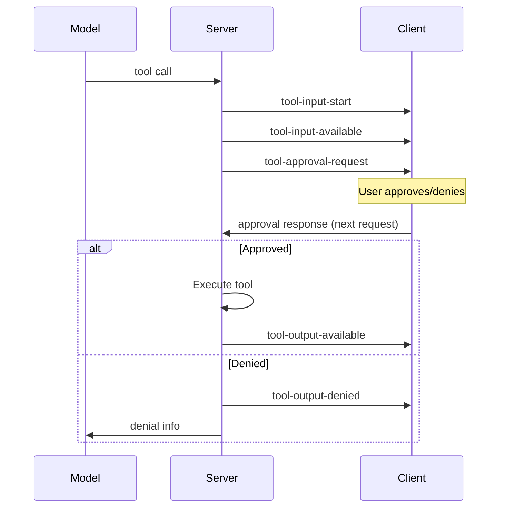

# Sequence Diagram Reference

## Basic Syntax

## Participants

Declare participants to control ordering:

Order participants left-to-right following data flow. Aliases keep labels concise.

## Message Types

| Syntax | Meaning |
|--------|---------|
| `->>` | Synchronous request |
| `-->>` | Async/return response |
| `--)` | Async message (no wait) |
| `-x` | Lost message |
| `--x` | Lost async message |

## Activations

Show when participants are active:

Use `+` to activate, `-` to deactivate. Activations can nest.

## Control Flow

### Alt/Else (Conditional)

### Opt (Optional)

### Loop

### Parallel

## Notes

Add context without cluttering the flow:

## Example: Tool Approval Protocol

From pydantic-ai tool approval flow:

## Best Practices

- Order participants by data flow (typically left-to-right)
- Use aliases to keep participant names short
- Use `Note over` for context that spans participants
- Use `alt`/`else` for branching outcomes
- Keep message labels concise—detail in prose
- Activations show processing time visually
