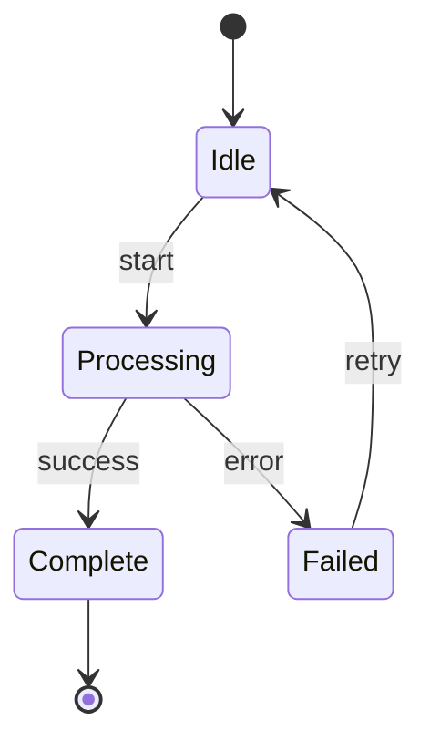
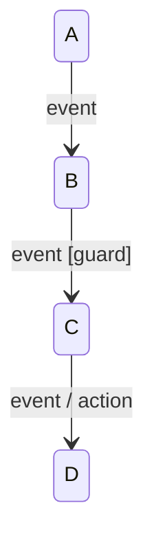
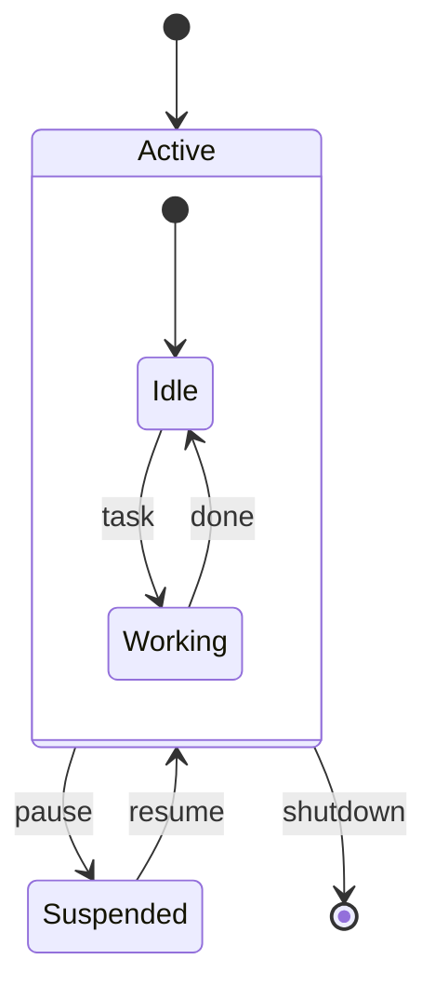
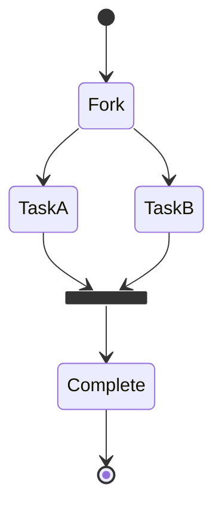
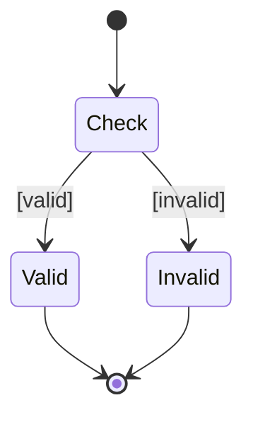
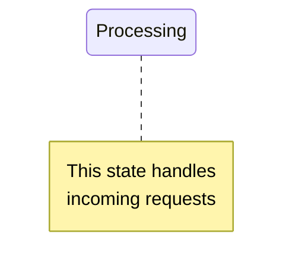
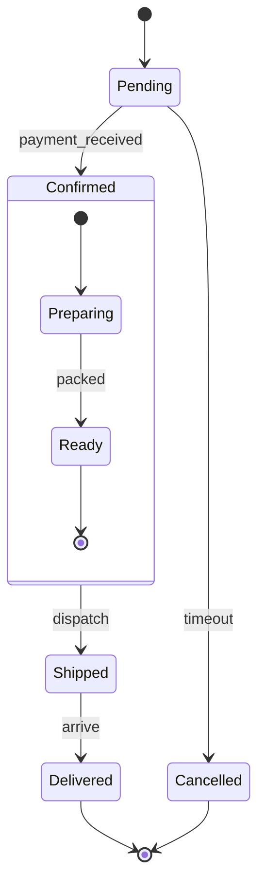

# State Diagram Reference

## Basic Syntax

Use `stateDiagram-v2` for the latest features:

## States

| Syntax | Meaning |
|--------|---------|
| `[*]` | Start or end state |
| `StateName` | Simple state |
| `StateName: Description` | State with description |

## Transitions

- **event**: What triggers the transition
- **[guard]**: Condition that must be true
- **/ action**: Side effect of the transition

## Composite States

Nest states for complex workflows:

## Forks and Joins

Parallel state regions:

## Choice (Decision)

## Notes

## Example: Order Lifecycle

## Best Practices

- Always use `[*]` for clear entry and exit points
- Group related states with composite states
- Use guards `[condition]` for conditional transitions
- Keep state names short, use descriptions for detail
- Order states to minimize arrow crossings
