# Valid Mermaid Fixtures

## Flowchart - Basic

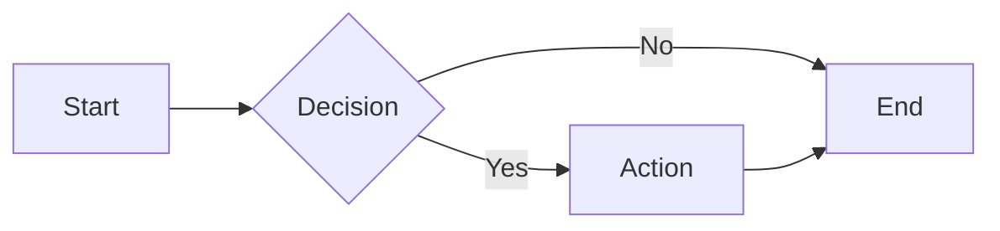

## Flowchart - Subgraph

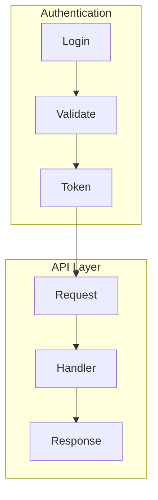

## Flowchart - Styled

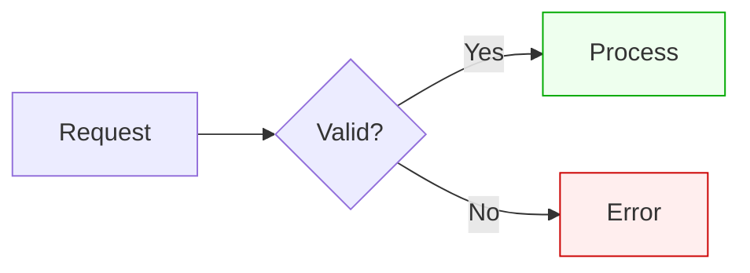

## Sequence - Basic

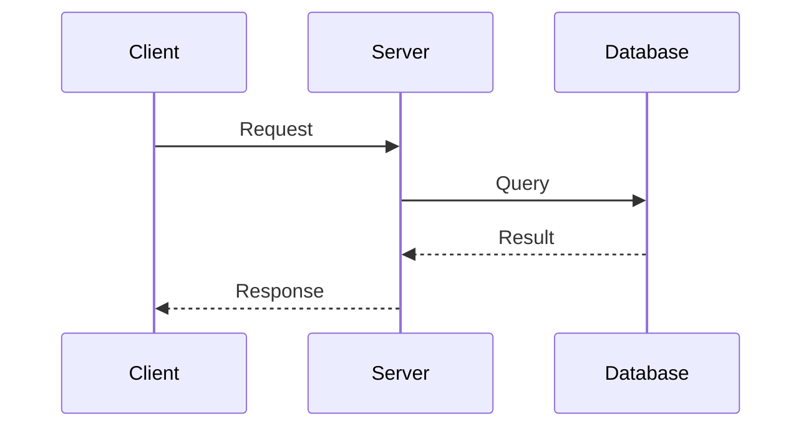

## Sequence - Alt

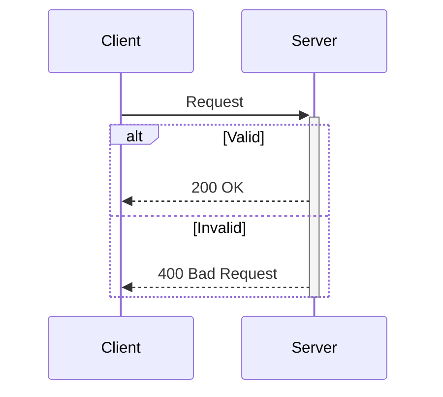

## Sequence - Loop

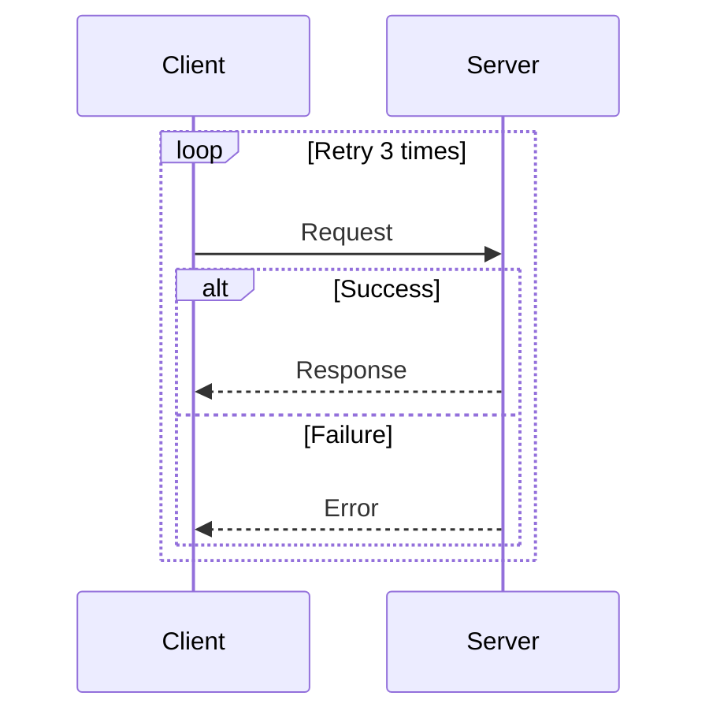

## Sequence - Notes

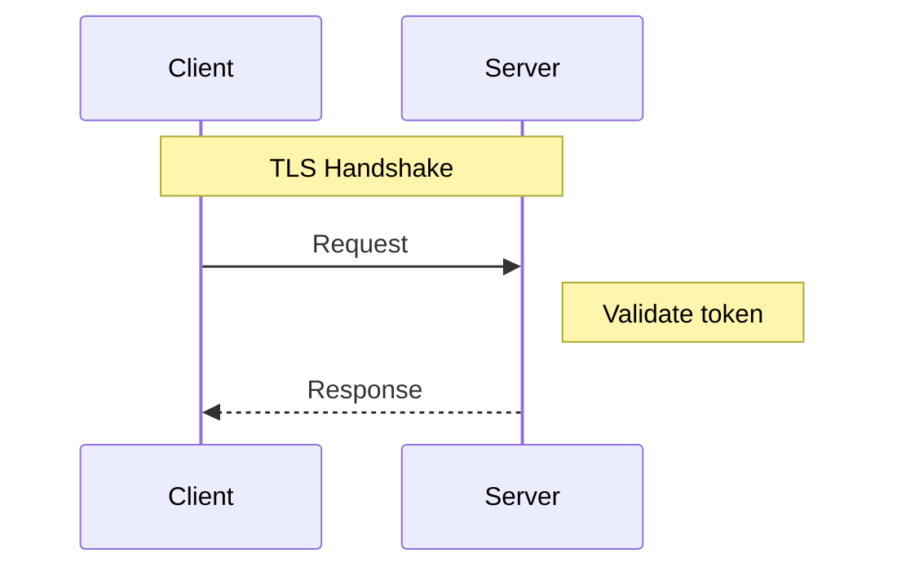

## State - Basic

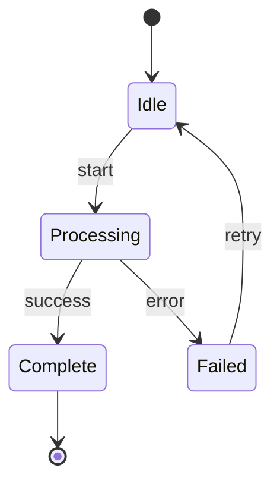

## State - Composite

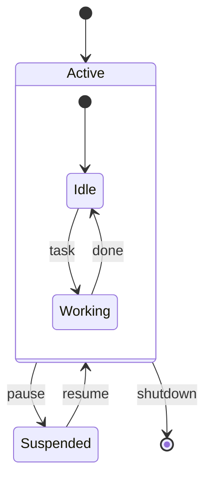

## ER - Basic

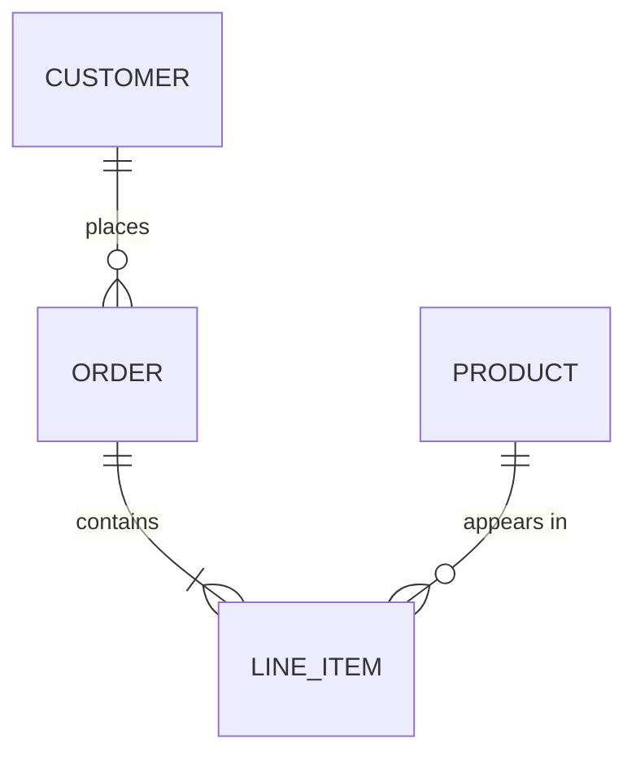

## ER - Attributes

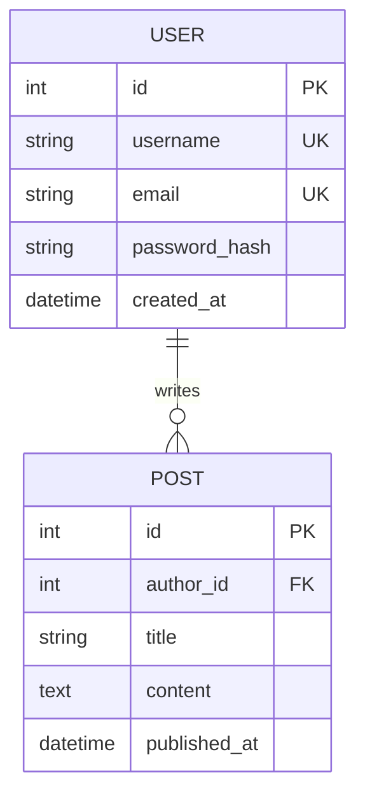
