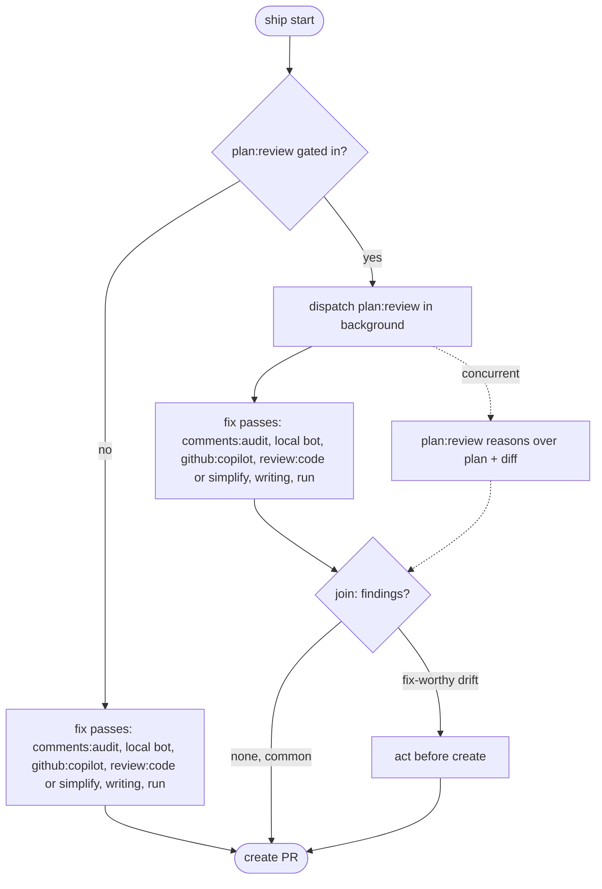

# Ship Passes

Gating decisions for ship's pre-PR reviews: which pass runs, `review:code` effort, `review:code` versus `simplify`, and why comment trims land the way they do.

## Gating Matrix

Most passes gate on the diff against the resolved base (the upstream tracking ref, resolved per `SKILL.md`) plus the working tree. `plan:review` gates on the plan and the session, not the diff (see [Plan Review](#plan-review)).

| Trigger | Pass | Notes |
|---|---|---|
| A substantial plan in context (`~/.claude/plans/` file) and a long or redirected session | `plan:review` | Read-only, non-blocking: background dispatch, joined before create |
| Code changes | `review:code <effort> --fix` or `simplify` | Exactly one. Skip on docs/config-only |
| New code comments | `comments:audit` | See [Comment Trims](#comment-trims) |
| A supported review bot is available for the repo and the diff clears the [Bot Review Gate](#bot-review-gate) | `pull-request:follow-up --local` | Reviews committed work, commits its fixes. Runs before the fix passes dirty the tree |
| Code changes on a repo whose remote owner is `bendrucker`, clearing the [Cross-Model Gate](#cross-model-gate) | `github:copilot` | Same slot as the local bot pass. Findings fix in-branch |
| Prose (`.md`, `.mdx`, `.rst`, docs) | `writing:review` | |
| A runtime surface | `run` | Ship declines docs-only and tests-only |

Gating is the cost lever: never run a reviewer the change does not warrant. `--skip <pass>` drops any of them (`plan`, `review:code`, `simplify`, `comments`, `bot`, `copilot`, `writing`, `run`). `code-review` is still accepted for `review:code`, and `verify` for `run`, so an old invocation does not silently run the pass it meant to skip.

## Bot Review Gate

A bot review is metered, and both channels draw the same meter: the local CLI plus a hosted review of the pushed branch costs two credits for one change. So one gate decides both, keyed on the diff alone. Churn is not worth a review on any repo.

Availability comes first, and `pull-request:follow-up` owns it. Its `detect-bot.ts` fast path reports each provider's repo config, CLI presence, and any live cooldown. Treat a paused provider as unavailable and skip the pass. `local.md` covers detection, `reviewers.md` covers what a cooldown means to a waiting loop.

Then spend a review when any of these hold:

- the diff touches auth, permissions, sandbox config, secret handling, or network egress
- it adds or changes a runtime surface: a hook, a script entry point, a CLI command, an API
- it is over roughly 100 changed lines or 4 files, excluding tests, docs, and lockfiles
- `review:code` confirmed a real bug, or the session redirected enough that the diff wandered

Nothing else qualifies. Prose, dependency bumps, and reverts never do, and neither does a config diff that stays clear of the risk surfaces in the first bullet. Editing sandbox or permissions config is the strongest reason on the list to spend, so "config" alone decides nothing.

#### Which Channel

A spend verdict buys **one** review through **one** channel. Both draw the same meter, so running the local CLI and then labeling the PR pays twice for one diff and puts credits back on the path that exhausted them.

Default to the local pass. It reports before the PR exists, so fixes land in the branch instead of as follow-up commits under a bot thread. Skip `--label review` on that run.

Fall back to the hosted pass when the local CLI cannot run: the provider's CLI is not installed, auth fails, or the liveness probe in `local.md` finds it dead. Then pass `--label review` to `pull-request:create` and let the hosted bot review the pushed branch. A live cooldown takes both channels away. That skips the pass entirely rather than switching.

My Greptile org sets `Labels / Include / review`, which skips any PR without a `review` label. That label exists in `bendrucker/claude`, `dotfiles`, and `bendrucker.me`. With `triggerOnUpdates` and `triggerOnDrafts` both off, a labeled PR draws one review at open and drafts draw none. `reviewers.md` covers the levers and the `@greptileai review` override.

These thresholds are a starting calibration to tune. Removal trigger: if the gate is right, `free_reviews_limit_reached` goes to zero in the session index and credits last the billing period. Too tight shows up as manual `--local` requests on PRs the gate skipped. Loosen the line count. Too loose and credits still run out early.

## Cross-Model Gate

`github:copilot` is the default cross-model channel. It reads the diff with GPT, which is worth something precisely because Claude reviewing its own work shares the blind spot that produced it.

This gate is separate from the Bot Review Gate above and does not couple to it. That gate conserves, because Greptile's free tier does not reset and a spent credit is gone. Copilot's meter refills on the 1st and does not roll over, so an unspent credit is also gone. The two meters point in opposite directions, and the one-review-one-channel rule applies within the bot gate rather than across both. A change can draw a Greptile review and a Copilot review without either paying for the other.

Spend when the diff clears the [Bot Review Gate](#bot-review-gate)'s own list above. The two gates share their criteria for what counts as review-worthy. They do not share a budget.

`github:copilot --status` prints the current tier and picks the shape. The tier is credits remaining over days to reset, constrained under 25 a day and abundant over 60. A burst of reviews tightens the bar on what follows, and the month-end tail loosens it. Never run a review to consume an allotment. Credits left over in a month where every qualifying change got a full review are the intended result.

Two things keep this inert on a work machine, and only one of them is code. An account with no personal Copilot entitlement has no `premium_interactions` quota, and the script treats an unreadable meter as a refusal rather than a default. The owner condition in the matrix row above is a routing rule this skill applies when it decides whether to invoke. The script itself never looks at the remote. A corporate account that did carry a quota would pass its guard.

Removal trigger: a full billing cycle with near-zero `skill_calls` for `github:copilot` in the session index, or this pass firing under about four times, means the demand does not route this way. Drop the row and re-demote the skill.

## Plan Review

Its value, an outside-view read of how the implementation drifted from what was approved, only materializes when the session could actually have drifted. Hence the two-part gate: a **substantial** approved plan in context, and a session that **ran long or redirected** enough for the diff to wander from it. A small plan executed in a short, direct session is cost without signal.

It is read-only and writes nothing, so it runs as a background dispatch rather than a serial pass. The DAG below is the ordering. Its point is to catch fix-worthy drift while the branch is still local, so findings are acted on before create and deferred follow-ups go to the report. No findings is the common outcome, and the join usually adds no wall-clock.

## Effort Inference

Infer `review:code` effort from the diff unless `--effort` overrides. `high` is routine for risky work. Reserve `xhigh` for explicit requests.

| Diff shape | Effort |
|---|---|
| Tiny: one file, a handful of lines | `low` |
| Ordinary change | `medium` |
| Risky: multiple plugins, hooks, permissions, sandbox, or auth-shaped code | `high` |
| Explicit request only | `xhigh` |

`review:code` picks its fan-out shape from its own cell table, keyed on model family as well as effort level, which is why the same `--effort` can mean one inline pass in one family and a fleet of finders plus per-candidate verifiers in another. Do not infer cost from the effort name.

## Code-Review Versus Simplify

Alternatives, not a pair. Pick `simplify` for a pure refactor or cleanup with no new behavior: extraction, renaming, dedup, dead-code removal, moving code. It covers reuse, simplification, efficiency, and altitude, and does not hunt bugs. Pick `review:code` for anything with new behavior, a bug fix, or a feature, which need the correctness coverage `simplify` skips. `--simplify` forces the `simplify` path.

## Babysit and Reviews

A bot review often lands after the green push with no CI event to key off. `--reviews` covers this: follow-up waits for an expected review's first pass, then triages it. Babysit owns the CI waits. Follow-up owns which reviews are expected (the signals in its `reviewers.md`) and the wait for them, so ship never restates them or hand-rolls a reviews-API poll. With none expected, the hand-off returns at once and ship stops at green.

## Comment Trims

`comments:audit` commits trims to a fresh `comments/audit-<hash>` branch off `HEAD` via git plumbing, and its apply requires a clean tree. Ship needs the trims on the shipping branch, so it runs the audit first (clean tree) and fast-forwards the shipping branch onto the audit commit. A clean audit writes no branch, so skip the fast-forward when none was printed.

Rejected:

- **`--report` plus inline apply**: pulls the full findings into ship's context, defeating the point of keeping bulk verdicts off the conversation.
- **Running it after `review:code --fix`**: the fix pass dirties the tree, failing `comments:audit`'s clean-tree check.
- **Invoking the audit's scripts directly from ship**: ship cannot resolve the comments plugin's install path, it would duplicate the three-step runbook, and it would widen ship's tool grant past `git diff` and `git status`. `comments:audit` was made model-invocable instead, the same remedy `review:code` applies to the built-in `/code-review`.
