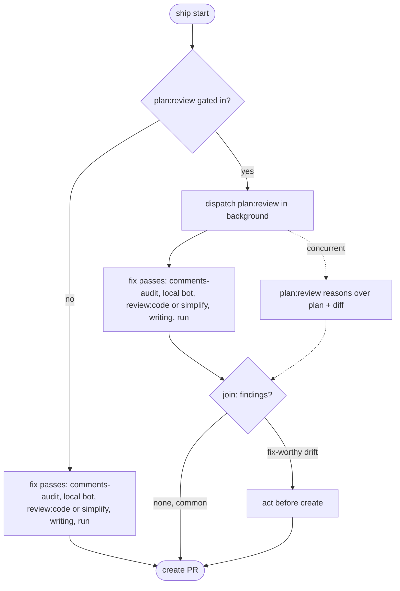

# Ship Passes

Gating decisions for ship's pre-PR reviews: which pass runs, `review:code` effort, `review:code` versus `simplify`, and why comment trims land the way they do.

## Gating Matrix

Most passes gate on the diff against the resolved base (the upstream tracking ref, resolved per `SKILL.md`) plus the working tree. `plan:review` gates on the plan and the session, not the diff (see [Plan Review](#plan-review)).

| Trigger | Pass | Notes |
|---|---|---|
| A substantial plan in context (`~/.claude/plans/` file) and a long or redirected session | `plan:review` | Read-only, non-blocking: background dispatch, joined before create |
| Code changes | `review:code <effort> --fix` or `simplify` | Exactly one. Skip on docs/config-only |
| New code comments | `comments:audit` | See [Comment Trims](#comment-trims) |
| A supported review bot is available for the repo and the diff clears the [Bot Review Gate](#bot-review-gate) | `pull-request:follow-up --local` | Reviews committed work, commits its fixes. Runs before the fix passes dirty the tree |
| Prose (`.md`, `.mdx`, `.rst`, docs) | `writing:review` | |
| A runtime surface | `run` | Ship declines docs-only and tests-only |

Gating is the cost lever: never run a reviewer the change does not warrant. `--skip <pass>` drops any of them (`plan`, `review:code`, `simplify`, `comments`, `bot`, `writing`, `run`). `code-review` is still accepted for `review:code`, and `verify` for `run`, so an old invocation does not silently run the pass it meant to skip.

## Bot Review Gate

A bot review is metered, and both channels draw the same meter: running the local CLI and then letting the hosted bot review the pushed branch costs two of the same credits for one change. So one gate decides both, and it keys on the diff alone. There is no repo classification: churn is not worth a review anywhere.

Availability comes first, and `pull-request:follow-up` owns it. Its `detect-bot.ts` fast path reports each provider's repo config, CLI presence, and any live cooldown. A paused provider is unavailable: skip the pass without probing it. `local.md` covers detection and `reviewers.md` covers what a cooldown means to a waiting loop.

Then spend a review when any of these hold:

- the diff touches auth, permissions, sandbox config, secret handling, or network egress
- it adds or changes a runtime surface: a hook, a script entry point, a CLI command, an API
- it is over roughly 200 changed lines or 8 files, excluding tests, docs, and lockfiles
- `review:code` confirmed a real bug, or the session redirected enough that the diff wandered

Skip otherwise. Always skip on prose-only, config-only, dependency bumps, and revert commits.

The gate also decides the hosted pass wherever the hosted bot waits to be asked: when it says spend, post the trigger comment after the PR exists, then wait through the normal path in `reviewers.md`. That file covers which Greptile settings actually make a repo on-demand, since turning automatic review off entirely is not one of them.

Treat the thresholds as a starting calibration to tune. Removal trigger: if the gate is right, `free_reviews_limit_reached` goes to zero in the session index and credits last the billing period. Too tight shows up as manual `--local` requests on PRs the gate skipped, and the fix is to loosen the line count. Too loose and credits still run out early.

## Plan Review

Its value, an outside-view read of how the implementation drifted from what was approved, only materializes when the session could actually have drifted. Hence the two-part gate: a **substantial** approved plan in context, and a session that **ran long or redirected** enough for the diff to wander from it. A small plan executed in a short, direct session is cost without signal.

It is read-only and writes nothing, so it runs as a background dispatch rather than a serial pass. The DAG below is the ordering. Its point is to catch fix-worthy drift while the branch is still local, so findings are acted on before create and deferred follow-ups go to the report. No findings is the common outcome, and the join usually adds no wall-clock.

## Effort Inference

Infer `review:code` effort from the diff unless `--effort` overrides. `high` is routine for risky work. Reserve `xhigh` and `max` for explicit requests.

| Diff shape | Effort |
|---|---|
| Tiny: one file, a handful of lines | `low` |
| Ordinary change | `medium` |
| Risky: multiple plugins, hooks, permissions, sandbox, or auth-shaped code | `high` |
| Explicit request only | `max` |

`review:code` picks its fan-out shape from its own cell table, keyed on model family as well as effort level, which is why the same `--effort` can mean one inline pass in one family and a fleet of finders plus per-candidate verifiers in another. Do not infer cost from the effort name.

`--effort ultra` is not inferrable and `review:code` cannot run it. It is a billed cloud review that only a user-typed `/code-review ultra` can launch. On `--effort ultra`, stop and say so rather than substituting a local level.

## Code-Review Versus Simplify

Alternatives, not a pair. Pick `simplify` for a pure refactor or cleanup with no new behavior: extraction, renaming, dedup, dead-code removal, moving code. It covers reuse, simplification, efficiency, and altitude, and does not hunt bugs. Pick `review:code` for anything with new behavior, a bug fix, or a feature, which need the correctness coverage `simplify` skips. `--simplify` forces the `simplify` path.

## Comment Trims

`comments:audit` commits trims to a fresh `comments/audit-<hash>` branch off `HEAD` via git plumbing, and its apply requires a clean tree. Ship needs the trims on the shipping branch, so it runs the audit first (clean tree) and fast-forwards the shipping branch onto the audit commit. A clean audit writes no branch, so skip the fast-forward when none was printed.

Rejected:

- **`--report` plus inline apply**: pulls the full findings into ship's context, defeating the point of keeping bulk verdicts off the conversation.
- **Running it after `review:code --fix`**: the fix pass dirties the tree, failing `comments:audit`'s clean-tree check.
- **Invoking the audit's scripts directly from ship**: ship cannot resolve the comments plugin's install path, it would duplicate the three-step runbook, and it would widen ship's tool grant past `git diff` and `git status`. `comments:audit` was made model-invocable instead, the same remedy `review:code` applies to the built-in `/code-review`.
