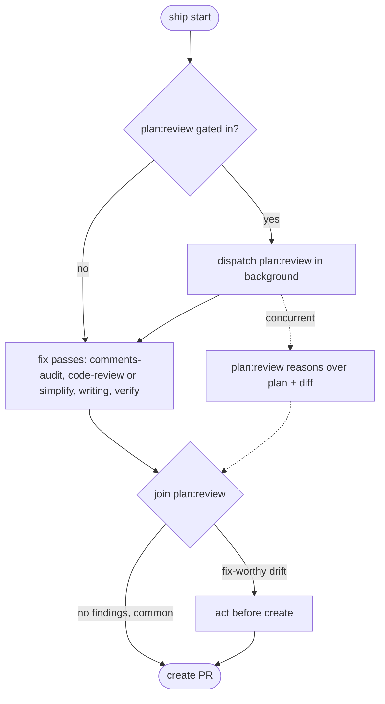

# Ship Passes

Gating decisions for ship's pre-PR reviews: which pass runs, `code-review` effort, `code-review` versus `simplify`, and why comment trims land the way they do.

## Gating Matrix

Most passes gate on the diff (against the base, plus the working tree). The base is its upstream tracking ref (e.g. `origin/<base>`), not a bare local branch, so a stale local `main` never inflates the file set with already-merged commits. `plan:review` gates on the plan and the session, not the diff (see [Plan Review](#plan-review)).

| Trigger | Pass | Notes |
|---|---|---|
| A substantial plan in context (`~/.claude/plans/` file) and a long or redirected session | `plan:review` | Read-only, non-blocking: background dispatch, joined before create |
| Code changes | `code-review <effort> --fix` or `simplify` | Exactly one. Skip on docs/config-only |
| New code comments | `comments:audit` | See [Comment Trims](#comment-trims) |
| Prose (`.md`, `.mdx`, `.rst`, docs) | `writing:review` | |
| A runtime surface | `verify` | Declines tests-only and docs-only itself |

Gating is the cost lever: never run a reviewer the change does not warrant. `--skip <pass>` drops any of them (`plan`, `code-review`, `simplify`, `comments`, `writing`, `verify`).

## Plan Review

`plan:review` is the one pass whose trigger is the plan, not the diff, and whose value (an outside-view read of how the implementation drifted from what was approved) only materializes when the session could actually have drifted. So it gates on two things together: a **substantial** approved plan in context, and a session that **ran long or redirected** enough for the diff to wander from it. A small plan executed in a short, direct session is cost without signal, so it skips.

It is read-only and writes nothing, so it runs as a background dispatch rather than a serial pass. The DAG below is the ordering. Its point is to catch fix-worthy drift while the branch is still local, so findings are acted on before create and deferred follow-ups go to the report. No findings is the common outcome, and the join usually adds no wall-clock.

## Effort Inference

Infer `code-review` effort from the diff unless `--effort` overrides. `high` is routine for risky work. Reserve `max` and `ultra` for explicit requests.

| Diff shape | Effort |
|---|---|
| Tiny: one file, a handful of lines | `low` |
| Ordinary change | `medium` |
| Risky: multiple plugins, hooks, permissions, sandbox, or auth-shaped code | `high` |
| Explicit request only | `max`, `ultra` |

`ultra` is a deep multi-agent cloud review. Never infer it: run it only on `--effort ultra`.

## Code-Review Versus Simplify

Alternatives, not a pair. Pick `simplify` for a pure refactor or cleanup with no new behavior: extraction, renaming, dedup, dead-code removal, moving code. It covers reuse, simplification, efficiency, and altitude, and does not hunt bugs. Pick `code-review` for anything with new behavior, a bug fix, or a feature, which need the correctness coverage `simplify` skips. `--simplify` forces the `simplify` path.

## Comment Trims

`comments:audit` commits trims to a fresh `comments/audit-<hash>` branch off `HEAD` via git plumbing, and its apply requires a clean tree. Ship needs the trims on the shipping branch, so it runs the audit first (clean tree) and fast-forwards the shipping branch onto the audit commit. A clean audit writes no branch, so skip the fast-forward when none was printed.

Rejected:

- **`--report` plus inline apply**: pulls the full findings into ship's context, defeating the point of keeping bulk verdicts off the conversation.
- **Running it after `code-review --fix`**: the fix pass dirties the tree, failing `comments:audit`'s clean-tree check.
