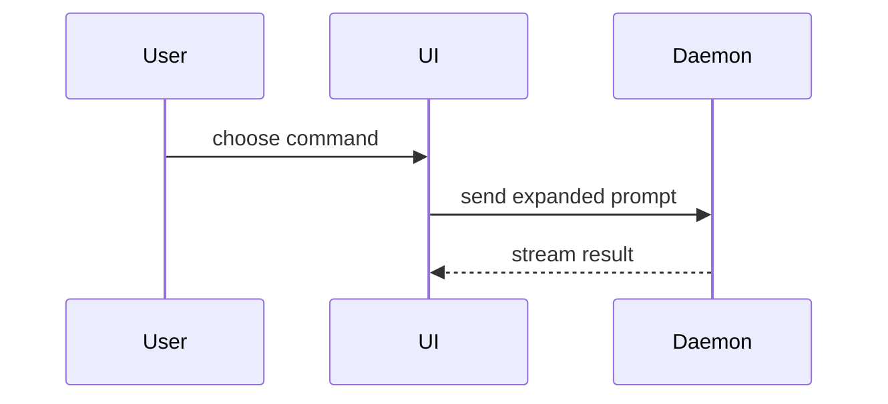

# Show Me

Explain $ARGUMENTS visually. Pick the smallest view that makes the point, and keep the prose around it short.

## Arguments

`$ARGUMENTS` names what to show. With no argument, show the current topic of conversation.

## Formats

Pick one format or several. Using all of them is rare.

### Pseudocode

For logic or an algorithm:

```text
on(save)
  if content is unchanged
    return cached result
  write new content
  return fresh result
```

### Call Tree

For runtime control flow:

```text
submitForm
  createSession
    persistPrompt
    launchAgent
  navigateToSession
```

### Component Tree

For UI structure. Annotate the state and the seams that matter:

```tsx
<SessionPage> (apps/example/src/routes/session.tsx)
  useSessionEvents()
  <SessionToolbar>
    <RunSkillButton> (packages/ui)
```

### File Tree

For file responsibility or the shape of a refactor. Keep it shallow and give each entry one line of responsibility:

```text
src/
├── commands/       # parses user actions
├── sessions/       # owns session state
└── transport/      # sends API requests
```

### Diff

Use a diff when the point is what changes and the surrounding shape already exists. Match the diff to the shape of the topic.

A component change diffs the component tree:

```diff
 <SessionPage>
   useSessionEvents()
   <SessionToolbar>
+    <RunSkillButton />
   <SessionTimeline>
+    <SkillResultCard />
```

A move or split diffs the file tree:

```diff
 src/
 ├── commands/
+│   └── show-me.ts       # expands the slash command
 ├── sessions/
-└── transport.ts
+└── transport/
+    ├── client.ts
+    └── stream.ts
```

A new step in an existing path diffs the call tree:

```diff
 submitForm
   createSession
     persistPrompt
+    expandSkillMention
     launchAgent
   navigateToSession
+    subscribeToEvents
```

A change in what runs when diffs the state or control flow:

```diff
 on(save)
-  write content
+  if content is unchanged
+    return cached result
+  write new content
+  invalidate cache
```

### Whole Block

Show the whole block when most of it is new, when omitted context would hide ownership or order, or when the user needs a copyable target shape:

```ts
function expandSkill(command: string): string {
  const skillName = command.slice(1)
  return `use the ${skillName} skill`
}
```

### Mermaid

For component interaction, control flow, or data flow:



### Artifact

For a rendered UI, a layout, a state comparison, or a concept too dense for Mermaid, publish an Artifact: a diagram, an infographic, or a short slide deck, whichever fits the point. Load the `artifact-design` skill first, write the page to a file, then call `Artifact` with that path. Artifacts render Mermaid natively. A fenced mermaid block inside the page needs no library.

Match the product's colors, type, spacing, and components. Use real labels and real data, and support desktop and mobile widths.

## Scope

Place each visual next to the short text it supports.

Keep only the calls, files, props, states, and seams needed to answer the question on the table. Cut every branch that doesn't bear on it.
