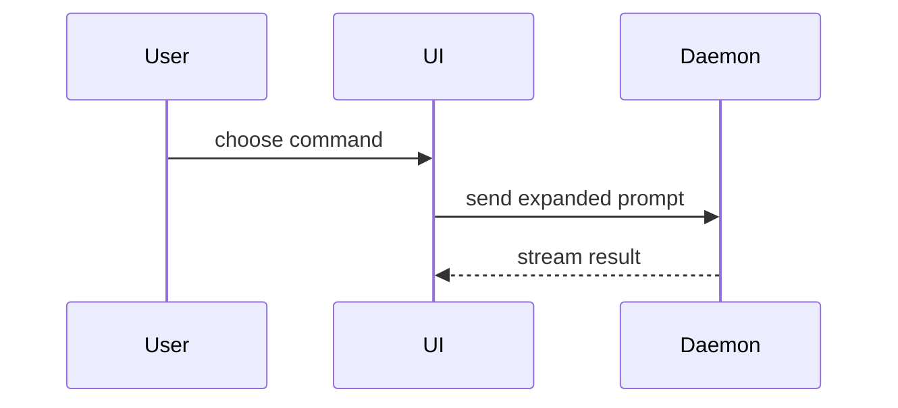

# Show Me

Explain $ARGUMENTS visually. Pick the smallest view that makes the point, and keep the prose around it short.

## Arguments

`$ARGUMENTS` names what to show. With no argument, show the current topic of conversation.

## Formats

Pick one format or several, rarely all.

### Pseudocode

Logic or an algorithm:

```text
on(save)
  if content is unchanged
    return cached result
  write new content
  return fresh result
```

### Call Tree

Runtime control flow inside one process:

```text
submitForm
  createSession
    persistPrompt
    launchAgent
  navigateToSession
```

### Component Tree

UI structure:

```tsx fragment
<SessionPage> (apps/example/src/routes/session.tsx)
  useSessionEvents()
  <SessionToolbar> (packages/ui)
  <SessionTimeline>
```

### File Tree

File responsibility or the shape of a refactor:

```text
src/
├── commands/       # parses user actions
├── sessions/       # owns session state
└── transport.ts    # sends API requests
```

### Diff

What changes, when the surrounding shape already exists.

Component tree:

```diff
 <SessionPage>
   useSessionEvents()
   <SessionToolbar>
+    <RunSkillButton />
   <SessionTimeline>
+    <SkillResultCard />
```

File tree:

```diff
 src/
 ├── commands/
+│   └── show-me.ts       # expands the slash command
 ├── sessions/
-└── transport.ts
+└── transport/
+    ├── client.ts
+    └── stream.ts
```

Call tree:

```diff
 submitForm
   createSession
     persistPrompt
+    expandSkillMention
     launchAgent
   navigateToSession
+    subscribeToEvents
```

State and control flow:

```diff
 on(save)
-  write content
-  return result
+  if content is unchanged
+    return cached result
+  write new content
+  return fresh result
```

### Whole Block

Most of the block is new, omitted context would hide ownership or order, or the user needs a copyable target shape:

```ts
function expandSkill(command: string): string {
  const skillName = command.slice(1)
  return `use the ${skillName} skill`
}
```

### Mermaid

Interaction that crosses modules or processes, and data flow through them:



### Artifact

A rendered UI, a layout, a state comparison, or a concept too dense for Mermaid. Load `artifact-design`, write the page to a file, then call `Artifact` with that path.

## Scope

Place each visual next to the short text it supports.

Keep only the calls, files, props, states, and seams that answer the question on the table.
